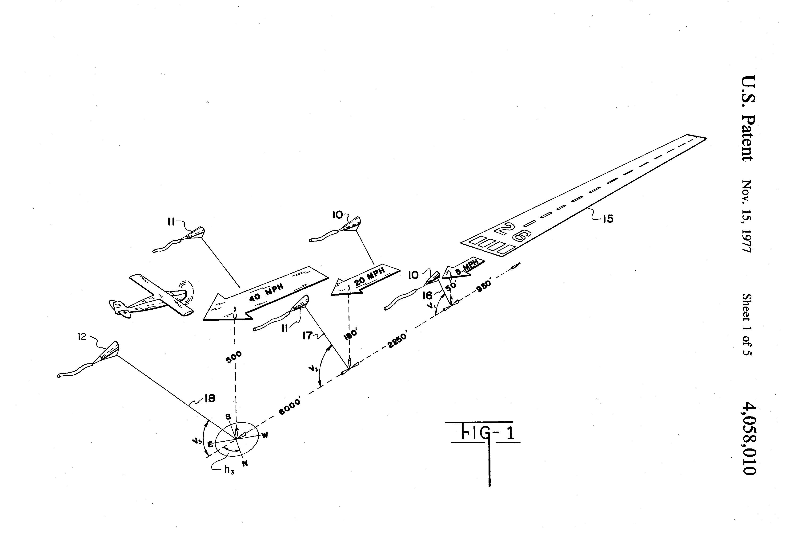

###Introduction to the TALA
The TALA, or Tethered Aerodynamic Lifting Anemometer, is a type of [Kite Wind Speed Meter](../Kite-Wind-Speed-Meter) or anemometer, a device for measuring the wind speed at the kite using ground measurements. The TALA repository consists of the [TALA kite](TALA_Kite) and [kite-specific corrections to ground-based measurements](TALA_Measurement) that can be used to accurately measure wind speed (anemometry) and turbulence at the kite's altitude, as well as a kit of recommended tools for taking the required ground based measurements.
 
###Current TALA kit 
* The [TALA kite](TALA_Kite)
* Spring scale for line tension
* compass for wind direction
* thermometer for ground temperature
* barometer for ground pressure
* clinometer for angles of the kite and kite line
* marked kite line for counting the amount of line in the air
 * or fishing line length counter 
* [look up tables and equations](TALA_Measurement) for extrapolating air speed from measurments

###[how you can contribute](contributing.md)

###Designers of the TALA
The kite was originally designed by Raymond P. Holland Jr. and adapted by Charles F. Woodhouse for anemometry into the TALA product sold by Approach Fish until some time in the early 1990's. The invention is covered by expired US patents 3,767,145, 4,058,010, 4,152,933 & 4,221,351.
	These plans are released under the [CERN OHL 1.2](LICENSE.MD), compiling [ongoing Public Lab research](www.publiclab.org/wiki/kite-anemometers) on the TALA into a DIY kit.
	
The TALA was imagined as an automated kite flight and measurement system providing local weather conditions at airports, but was usually flown by hand with a spring gauge used in the current TALA kit. Learn more about the [TALA and kite anemometer research in the Public Lab Wiki.](https://publiclab.org/wiki/kite-anemometers)

###About this project
The TALA repository is a project of [Public Lab](www.publiclab.org) to [collect ongoing research into kite anemometry](www.publiclab.org/tag/kite-anemometer) into a stable device replicating the TALA and licensed under [CERN OHL 1.2](LiCENSE.md).

To read more about using kite anemometers and find resources and sources used in this repository, visit the [Public Lab Wiki](publiclab.org/wiki/kite-anemometers). To learn more about contibuting, please read our [contribution guidelines](contributing.md).

