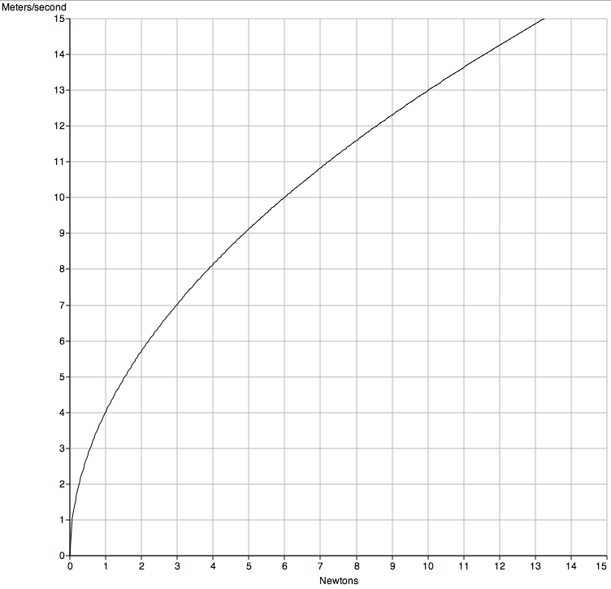

###TALA measurements
Measurements should be taken manually according to the [United States Air Force Vertical Profiling Procedure.](USAF_TALA.md)

####Determining velocity in relation to force on the kite
At ICAO standard Day Pressure of 1013.25mbar (sea level) at 15° C the TALA shows 2% accuracy to the equation:

V= 0.5144(N/0.01779)^0.510
Where V is m/s and N is Newtons

* When the lower half of the tail is disconnected, indicated air speed is lowered by 1% _(from the manual, page 8)_

 
_graph made with [mathpad](http://pubpages.unh.edu/~mwidholm/MathPad/)_

####Correcting for temperature and pressure
Measurements need to be corrected for temperature or pressure, expressed in [“pressure altitude.”](http://www.srh.noaa.gov/images/epz/wxcalc/pressureAltitude.pdf) 

Pressure Altitude = (1-(P/1013.25)^0.190284)x145366

Where P is the measured pressure in millebar. By adding the altitude of the TALA to the pressure altitude measured at ground level, a pressure altitude correction can be obtained. The TALA manual suggests adding Indicated Air Speed (IAS) to  IASx%Correction to provide True Air Speed (TAS)

TAS=IAS + IASx%Correction

